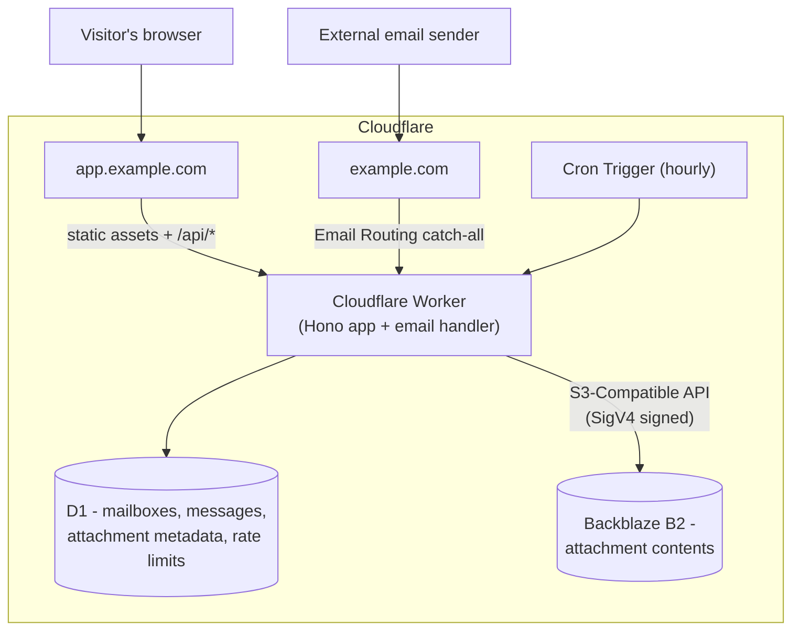

<div align="center">


# SubMail

**A disposable email service that deletes itself. No account, no signup, no tracking.**

[](https://github.com/justinbat22/SubMail/actions/workflows/ci.yml)
[](LICENSE)
[](package.json)
[](tsconfig.json)
[](#testing)
[](https://developers.cloudflare.com/workers/)
[](https://www.backblaze.com/cloud-storage)
[](CONTRIBUTING.md)

</div>

---

SubMail gives a visitor a working email address the moment they load the page. Mail sent to
that address is parsed, stored, and shown in a simple inbox in the same browser tab — and the
mailbox, its messages, and every attachment are **deleted automatically after a configurable
TTL** (24 hours by default). Access to a mailbox's contents is always gated by a separate
secret token, never by knowledge of the address alone.

```
emiliano.zieme.1439@yourdomain.com
kshlerin.antonina.9290@yourdomain.com
thauck.2250@yourdomain.com
```

The whole system — the web app, the API, and the code that parses incoming mail — runs as
**one Cloudflare Worker**. There is no separate backend server, no VM, no container, and no
external name-generation or mailbox API.

## Contents

- [Features](#features)
- [Architecture](#architecture)
- [Quick start](#quick-start)
- [Requirements](#requirements)
- [Project structure](#project-structure)
- [Cloudflare setup](#cloudflare-setup)
- [Environment variables](#environment-variables)
- [Development](#development)
- [Testing](#testing)
- [API reference](#api-reference)
- [Security](#security)
- [Dependency choices](#dependency-choices)
- [Operational notes](#operational-notes)
- [Production deployment](#production-deployment)
- [Known limitations](#known-limitations)
- [Contributing](#contributing)
- [License](#license)

## Features

- **Faker-style address generation**, entirely local — no network calls, no third-party name
  API. Hundreds of first names and surnames are bundled in the Worker, combined via five
  different patterns (`first.last.####`, `last.first.####`, `first##.####`, `last.####`,
  `first.last####`) so addresses don't look mechanically generated.
- **Custom addresses** with live availability checking.
- **Real email receiving** via Cloudflare Email Routing — plain text, HTML, multipart, and
  attachments, parsed with `postal-mime`.
- **Attachments** stored in Backblaze B2 under unpredictable keys, never served publicly —
  only through an authenticated Worker endpoint.
- **Security-first HTML rendering**: incoming HTML email is rendered in a fully sandboxed
  `<iframe sandbox="">` with its own strict CSP. No `allow-scripts`, no `allow-same-origin`.
  Remote images are blocked by default (only inline `data:` images load) to avoid tracking
  pixels, with an explicit "Load images" opt-in.
- **No account, ever.** A mailbox is a random ID plus a separate, high-entropy access token —
  the token is Web-Crypto-generated, stored only as a SHA-256 hash, and never derived from or
  interchangeable with the email address.
- **Automatic + immediate cleanup**: an hourly Cron Trigger sweeps expired mailboxes in
  bounded batches; deleting a mailbox (or a single message) is instant and cascades through
  D1 and B2.
- **No countdown timer.** The TTL is enforced server-side and is never surfaced as a ticking
  clock in the UI.
- **Live inbox** — the page visibly auto-refreshes (with an explicit connection status), and
  new arrivals are highlighted and toasted.
- Dark / light / system theme, mobile-first responsive layout, two-column desktop layout,
  keyboard and screen-reader accessible.

## Architecture



One Worker, two triggers into it (HTTP requests and incoming email), one storage binding
(D1 for structured data and rate limits), one external object store (Backblaze B2, via its
S3-Compatible API over SigV4-signed requests, for attachment bytes), and one Cron Trigger
for cleanup. Static frontend files (`public/`) are served by Cloudflare's Workers Static
Assets directly from the edge; anything under `/api/*` reaches the Worker's `fetch` handler.

## Quick start

```bash
git clone https://github.com/justinbat22/SubMail.git
cd SubMail
npm install
npx wrangler login

# one-time: create the D1 database and paste its id into wrangler.toml
npx wrangler d1 create submail-db
npx wrangler d1 migrations apply submail-db --local

npm run dev          # http://localhost:8787 — full app, no B2 credentials needed
```

Full production setup (Email Routing, B2 bucket + app key, secrets, deploy) is below.

## Requirements

- A Cloudflare account with a domain you control (for Email Routing) — or just Workers
  access for local development/testing without real mail.
- A [Backblaze B2](https://www.backblaze.com/) account with a private bucket and a dedicated
  application key (see setup step 3).
- [Node.js](https://nodejs.org/) 22+
- [Wrangler](https://developers.cloudflare.com/workers/wrangler/) (installed as a dev
  dependency; invoked via `npx wrangler`)

## Project structure

```
src/
├── index.ts                 # Worker entry: Hono app, fetch/scheduled/email handlers
├── routes/                  # mailbox.ts, message.ts, attachment.ts, health.ts
├── email/                   # handler.ts (Email Routing entry), parser.ts (postal-mime wrapper)
├── lib/                     # username-generator, token, validation, rate-limit, security,
│                            # request-body (JSON parsing), mime-guards (parser safety limits), b2 (object storage)
├── db/                      # D1 data-access: mailboxes.ts, messages.ts
├── cleanup/                 # expired-mailboxes.ts (Cron job)
└── types/                   # shared Env + DTO types

data/
├── first-names.ts           # ~490 bundled first names
└── surnames.ts              # ~540 bundled surnames

migrations/                  # D1 schema migrations (0001-0004; see operational notes
                             # for the mailbox_limits table migration 0003 adds)
tests/                       # vitest-pool-workers test suite (200 tests, 14 files)
├── helpers/migrate.ts       # shared migration-application helper for all test files
public/                      # static frontend: index.html, app.js, styles.css, theme-init.js,
                             # terms.html, logo.svg, _headers (static-asset security headers/CSP)
.github/workflows/ci.yml     # test on every push/PR; deploy on main after tests pass
```

## Cloudflare setup

These steps assume a fresh Cloudflare account. Run them once per environment
(development/staging/production).

### 1. Install dependencies and log in

```bash
npm install
npx wrangler login
```

### 2. Create the D1 database

```bash
npx wrangler d1 create submail-db
```

Copy the `database_id` from the output into `wrangler.toml`:

```toml
[[d1_databases]]
binding = "DB"
database_name = "submail-db"
database_id = "PASTE_YOUR_ID_HERE"
```

Apply the schema:

```bash
npx wrangler d1 migrations apply submail-db --local   # for local dev
npx wrangler d1 migrations apply submail-db --remote  # for the deployed Worker
```

This applies all four migrations, including the `mailbox_limits` table and the trigger that
enforces `MAX_MESSAGES_PER_MAILBOX` atomically at the database level — see
[Operational notes](#operational-notes) for what that means if you ever change that limit.

### 3. Set up Backblaze B2

Attachment storage lives in Backblaze B2 via its S3-Compatible API
([docs](https://www.backblaze.com/docs/cloud-storage-s3-compatible-api)):

1. In the Backblaze console, create a **private** bucket (e.g. `submail-attachments`). Note
   the bucket's **Endpoint**, which contains the region (e.g.
   `s3.us-east-005.backblazeb2.com` → region `us-east-005`).
2. Under **Application Keys**, add a new application key **restricted to that bucket** with
   the capabilities `readFiles`, `writeFiles`, and `deleteFiles` (`writeFiles` +
   `deleteFiles` are both needed for the batch Delete Objects call). Note the **keyID** and
   the **key** — the key is shown only once.
3. Set the credentials as Worker secrets (never in `wrangler.toml`):

   ```bash
   npx wrangler secret put B2_KEY_ID           # the app key's keyID
   npx wrangler secret put B2_APPLICATION_KEY  # the app key itself
   ```

   `B2_REGION` and `B2_BUCKET` are non-secret and live in the `[vars]` block of
   `wrangler.toml`.

Important: the **master account key does not work** with the S3-Compatible API — only
application keys created as above do. The bucket must stay private; attachments are only
ever served through the Worker's authenticated `/api/attachments/:id` endpoint.

### 4. Configure Email Routing

Email Routing is configured at the zone level in the Cloudflare dashboard, not in
`wrangler.toml`:

1. In the Cloudflare dashboard, select the domain you want mail to arrive at (e.g.
   `example.com`) and open **Email** → **Email Routing**.
2. Enable Email Routing. Cloudflare will add the necessary MX and SPF DNS records
   automatically.
3. Under **Routing rules**, add a **Catch-all address** rule with the action **Send to a
   Worker**, and select this Worker (deploy it first — step 6 — so it appears in the list).
4. Do **not** add an HTTP redirect or proxy rule on the mail domain that would interfere
   with mail delivery — MX records aren't affected by proxy status, but avoid pointing the
   domain's `A`/`CNAME` at something that fights with Email Routing's own DNS records.

If `app.example.com` (the web app) and `example.com` (mail) are different hostnames — the
recommended split — the web app's DNS/routes are configured separately in
**Workers & Pages → your Worker → Triggers → Routes/Custom Domains**.

### 5. Configure the Cron Trigger

Already declared in `wrangler.toml`:

```toml
[triggers]
crons = ["0 * * * *"]  # hourly
```

No dashboard step needed — this activates automatically on deploy.

### 6. Set environment variables and deploy

Edit the `[vars]` block in `wrangler.toml` (`EMAIL_DOMAIN`, `APP_URL`, TTL, and size limits
— see [Environment variables](#environment-variables)), then:

```bash
npx wrangler deploy
```

Re-run step 4 once the Worker exists so it's selectable as an Email Routing destination.

## Environment variables

All configuration lives in `wrangler.toml`'s `[vars]` block (or per-environment
`[env.<name>.vars]`). D1 access is via a binding, so it needs no credentials. Backblaze B2
access is credential-based: `B2_KEY_ID` and `B2_APPLICATION_KEY` are **secrets** set via
`wrangler secret put` (see setup step 3) and must never be committed; `B2_REGION` and
`B2_BUCKET` are non-secret and live in `[vars]`.

| Variable                      | Purpose                                             | Default    |
| ------------------------------ | ---------------------------------------------------- | ---------- |
| `EMAIL_DOMAIN`                 | Domain new addresses are generated under             | `example.com` |
| `APP_URL`                      | Public URL of the web app (informational/CORS-free)  | `https://app.example.com` |
| `MAILBOX_TTL_HOURS`            | Mailbox lifetime before automatic cleanup            | `24`       |
| `MAX_MESSAGE_SIZE`             | Max accepted raw message size, bytes                 | `10485760` (10 MiB) |
| `MAX_ATTACHMENT_SIZE`          | Max accepted size per attachment, bytes              | `5242880` (5 MiB) |
| `MAX_ATTACHMENTS_PER_MESSAGE`  | Attachments kept per message; extras are dropped     | `10`       |
| `MAX_MESSAGES_PER_MAILBOX`     | Mailbox capacity; further mail is bounced (SMTP reject) | `200`   |
| `CLEANUP_BATCH_SIZE`           | Mailboxes processed per Cron invocation              | `50`       |
| `B2_REGION`                    | B2 S3 endpoint region (from the bucket's Endpoint)   | `us-east-005` |
| `B2_BUCKET`                    | Private B2 bucket holding attachment contents        | `submail-attachments` |
| `B2_KEY_ID`                    | B2 application key ID (**secret** — `wrangler secret put`) | — |
| `B2_APPLICATION_KEY`           | B2 application key (**secret** — `wrangler secret put`) | — |

For local development against `localhost`, the defaults work as-is — mail delivery obviously
requires a real domain with Email Routing configured, but the mailbox/API/frontend flow
works fully without it.

## Development

```bash
npm install
npm run dev          # wrangler dev - local Worker + simulated D1 (B2 needs credentials only for real attachment uploads)
npm run typecheck    # tsc --noEmit
npm run lint         # eslint
npm test             # vitest, via @cloudflare/vitest-pool-workers
npm run build        # type-check build gate (wrangler itself bundles at deploy time)
```

`npm run dev` serves the frontend from `public/` and the API from the same origin, matching
production. Without a configured Email Routing rule, you can still exercise the whole
mailbox/API/UI flow locally; simulating incoming mail without a real Email Routing rule is
what the test suite's `email()` handler tests are for (see below).

## Testing

The test suite runs against the **actual Workers runtime** (`workerd`) via
`@cloudflare/vitest-pool-workers` — not a Node.js approximation — with real D1 simulated
locally. Attachment storage goes through the seam in `src/lib/b2.ts`: when an R2-compatible
`ATTACHMENTS` binding exists (as the local test config provides), it is used; in production
the binding is absent and B2's S3-Compatible API is used — same code paths, no network or
credentials needed for tests. 200 tests across 14 files:

- **`username-generator.test.ts`** — thousands of generated usernames checked for valid
  syntax, dataset membership, length bounds, reserved-name exclusion, and
  pattern-distribution sanity, plus collision-retry behavior.
- **`validation.test.ts`**, **`token.test.ts`**, **`attachment-validation.test.ts`**,
  **`html-sanitize.test.ts`**, **`mime-guards.test.ts`** — focused unit tests for each
  security-relevant primitive (normalization, confusable-Unicode rejection, constant-time
  token comparison, filename sanitization, HTML stripping, MIME structural limits, parse
  timeouts).
- **`json-and-pagination.test.ts`** — strict JSON body validation (malformed JSON,
  null/array/primitive bodies, wrong Content-Type never silently becoming `{}`) and strict
  pagination validation (decimals, NaN, Infinity, negative values all rejected, not
  coerced), plus opaque-ID format checks.
- **`email-parser.test.ts`** — MIME parsing against hand-built multipart messages (plain
  text, HTML, attachments, missing headers, malformed input).
- **`mailbox.test.ts`**, **`email-handler.test.ts`** — full HTTP-level and
  `email()`-handler-level integration tests: mailbox creation/auth/deletion, end-to-end
  mail delivery into a mailbox and back out through the API, cross-mailbox isolation,
  oversized-message and full-mailbox rejection.
- **`concurrency.test.ts`** — the two properties the message-limit trigger and delivery
  idempotency exist for, proven under real concurrent load: a mailbox's message count never
  exceeds its configured limit even under 25 simultaneous deliveries, and 6 concurrent
  retries of the identical message collapse to exactly one stored copy with no orphaned
  storage objects.
- **`transient-failures.test.ts`** — proves the permanent-vs-transient email failure split
  actually works, via real fault injection (a broken storage/D1 binding): transient
  failures propagate out of `email()` so Cloudflare can retry them, while permanent
  conditions (malformed MIME, unknown recipient, duplicate delivery) still resolve
  normally, never throwing.
- **`security.test.ts`** — rate limits actually tripped (not just configured) including a
  window-reset check, expired-token/expired-mailbox handling, enumeration-resistance
  (identical error responses for "no such mailbox" vs. "wrong token"), a full
  cross-mailbox authorization matrix, and end-to-end XSS/path-traversal payloads run
  through the real pipeline.
- **`cleanup.test.ts`** — the Cron job's expired-vs-active mailbox handling, D1+storage
  cascade deletion, bounded batching across multiple runs, and idempotency.

```bash
npm test
```

## API reference

All endpoints are same-origin JSON, prefixed `/api`. Responses are always
`{ "success": true, "data": ... }` or `{ "success": false, "error": { "code", "message" } }`.
Mailbox-scoped endpoints require `X-Mailbox-Id: <id>` and `Authorization: Bearer <token>`
headers — the token is returned exactly once, at creation time.

| Method | Path                          | Auth | Description |
| ------ | ----------------------------- | ---- | ----------- |
| POST   | `/api/mailbox`                | —    | Create a mailbox. Body `{}` for an auto-generated address, or `{ "localPart": "name" }` for a custom one. |
| GET    | `/api/mailbox`                | ✓    | Fetch the authenticated mailbox's own info. |
| GET    | `/api/mailbox/check`          | —    | `?localPart=name` — availability check (rate-limited). |
| DELETE | `/api/mailbox`                | ✓    | Immediately delete the mailbox and everything in it. |
| GET    | `/api/mailbox/messages`       | ✓    | List messages, newest first. `?limit=&offset=`. |
| GET    | `/api/mailbox/messages/:id`   | ✓    | Full message detail, including attachment metadata. |
| DELETE | `/api/mailbox/messages/:id`   | ✓    | Delete a single message and its attachments. |
| GET    | `/api/attachments/:id`        | ✓    | Download an attachment (streamed from B2). |
| GET    | `/api/health`                 | —    | `{ "status": "ok" }` — no infrastructure details exposed. |

## Security

Summarized here; see inline comments in `src/lib/security.ts`, `src/lib/auth.ts`,
`src/email/handler.ts`, and `public/app.js` for the specifics.

- **Mailbox access tokens**, not addresses, are the credential: 256 bits of
  `crypto.getRandomValues` entropy, SHA-256-hashed at rest, compared in constant time.
- **Mailbox message limits are enforced atomically at the database level** (a
  `BEFORE INSERT` trigger, not an application-level count-then-insert), closing a race
  where concurrent deliveries could both pass a stale count check and together push a
  mailbox over its cap — verified under real concurrent load in `tests/concurrency.test.ts`.
  See [Operational notes](#operational-notes).
- **Email delivery is idempotent and internally atomic**: incoming mail is uploaded to B2
  first, then written to D1 as a single atomic batch (message + all attachment rows
  together — proven empirically to be all-or-nothing). A `UNIQUE(mailbox_id, message_id)`
  index makes a retried delivery (e.g. after a transient failure) a safe no-op instead of a
  duplicate, with any now-redundant uploads cleaned up.
- **Transient vs. permanent email failures are handled differently on purpose**: permanent
  conditions (malformed MIME, unknown recipient, mailbox full, already-processed duplicate)
  are handled inline and never retried; genuinely unexpected failures (a B2 or D1 outage)
  propagate out of the Worker's `email()` entrypoint so Cloudflare's own retry mechanism
  can recover the message, rather than being silently swallowed and lost.
- **MIME parsing is guarded against pathological input** `postal-mime` itself exposes no
  safety-limit configuration, so `src/lib/mime-guards.ts` adds pre-parse checks (header
  block size, declared part count, nested `message/rfc822` count) plus a wall-clock parse
  timeout, on top of the existing total-message-size cap.
- **Untrusted HTML email** is rendered in a `sandbox=""` iframe (no `allow-scripts`,
  `allow-same-origin`, `allow-forms`, or `allow-popups`) with its own strict CSP, plus a
  defense-in-depth textual sanitizer applied before storage. The sandbox — not the
  sanitizer — is the actual security boundary.
- **Attachments**: random object keys (`attachments/{mailboxId}/{messageId}/{randomId}`) in
  a **private** B2 bucket, never the original filename, filenames sanitized against path
  traversal and null bytes, served only through an authenticated endpoint that forces
  `Content-Disposition: attachment` for anything with an HTML/SVG/XML/JS extension **or**
  declared content-type (checked independently, since a sender can name a file
  "invoice.pdf" while declaring `Content-Type: text/html`).
- **Static frontend assets carry real security headers.** With Workers Static Assets, a
  request for `index.html`/`app.js`/etc. is served directly from Cloudflare's edge and
  never reaches the Worker at all — so the Worker's own header-injecting middleware can't
  apply to it. Headers (including a CSP scoped to what the frontend actually needs — no
  `unsafe-inline`, since the former inline theme-flash script was externalized to
  `theme-init.js`) are instead set via `public/_headers`, Cloudflare's documented mechanism
  for exactly this case.
- **D1's `UNIQUE(address)` constraint is authoritative** for mailbox uniqueness — creation
  is insert-and-handle-conflict, never check-then-insert, so concurrent requests can't race
  into a duplicate.
- **Every mailbox-scoped route is rate-limited**, including ones with no route-specific
  limit of their own — the check lives inside the shared `requireMailboxAuth` middleware
  itself, so it can't be bypassed by hitting a route that forgot to add its own.
- **Strict, fail-closed input validation**: request bodies that aren't valid JSON (or valid
  JSON of the wrong shape — `null`, arrays, primitives) are rejected outright rather than
  silently coerced to `{}`; pagination parameters must be genuine base-10 integers (no
  decimals, `NaN`, `Infinity`, or exponent notation); every opaque ID
  (mailbox/message/attachment) is validated against its exact expected shape before it ever
  reaches a database query.
- **Enumeration resistance**: a nonexistent mailbox ID and a wrong token for a real mailbox
  return byte-identical error responses; a malformed-shaped ID is rejected identically to a
  well-formed-but-missing one.
- **No open relay**: this Worker only ever receives mail; there is no code path that sends
  or forwards email anywhere.
- **Privacy**: no accounts, no phone numbers, no analytics. Logs are structured (route,
  status, mailbox ID, error code) and never include tokens, full message bodies, or
  attachment contents.

## Dependency choices

Runtime dependencies (`hono`, `postal-mime`, `aws4fetch`) are kept at their latest stable
releases — these are what actually ship in the deployed Worker bundle and process untrusted
internet email, so they get the most scrutiny. `aws4fetch` is a ~2.5 kB gzipped AWS SigV4
request signer built for Workers' `fetch` + SubtleCrypto, used to sign requests to B2's
S3-Compatible API.

Dev-only tooling (`wrangler`, `@cloudflare/vitest-pool-workers`, `vitest`) never ships in
the Worker bundle, but is kept as current as the toolchain allows:

- `wrangler` is on the latest stable line (4.137.x), which resolves every `npm audit`
  finding in its own tree (`esbuild`, `undici`, `ws`).
- The test stack is `vitest@4.x` + `@cloudflare/vitest-pool-workers@0.22.x`, paired to the
  versions pool-workers declares as its peer range, plus `@cloudflare/workers-types@5`.
  `npm install` runs with `legacy-peer-deps` (repo `.npmrc`) because pool-workers pins an
  alpha `miniflare`/`wrangler` internally whose peer metadata trips npm 10's strict
  resolver; there is no real peer conflict.
- The **one remaining `npm audit` finding** (a `sharp` advisory inherited by pool-workers'
  internal alpha miniflare pin) is dev-only and unreachable from the deployed Worker — the
  deploy bundle contains `hono`, `postal-mime`, and `aws4fetch` and zero trace of any test
  tooling. It will clear when Cloudflare ships a stable miniflare release to pool-workers;
  forcing that pin today would break the test runtime, so it is left in place and
  documented rather than hidden.

## Operational notes

**Changing `MAX_MESSAGES_PER_MAILBOX`.** The env var in `wrangler.toml` drives an early
rejection (avoiding wasted MIME-parsing/storage-upload work for an obviously-full mailbox),
but the *authoritative*, race-safe enforcement is a database trigger
(`migrations/0003_mailbox_message_limit.sql`) reading from a `mailbox_limits` config table
— SQLite triggers can't read a Worker's environment variables. If you change
`MAX_MESSAGES_PER_MAILBOX`, also run:

```sql
UPDATE mailbox_limits SET value = <new_limit> WHERE key = 'max_messages_per_mailbox';
```

against the same D1 database (`wrangler d1 execute submail-db --remote --command "..."`).
The two are independent on purpose — see the migration file's comments for the full
reasoning (a `COUNT(*)`-based trigger rather than a separately maintained counter column,
specifically so it can never drift out of sync with deletions from any code path).

**Expired-mailbox deletion.** The hourly Cron Trigger calls the Worker's `scheduled()`
handler, which processes up to `CLEANUP_BATCH_SIZE` expired mailboxes per run: every
attachment object is deleted from B2, then the mailbox row (and everything cascading from
it) is deleted from D1. Expired mailboxes are also rejected at delivery time and every
authenticated route, so a mailbox stops working the moment it expires even before the
sweep reaches it. The job is idempotent and bounded — see `tests/cleanup.test.ts`.

## Production deployment

`.github/workflows/ci.yml` runs type-checking, linting, and the full test suite on every
push and pull request (Node 22). A second job deploys to Cloudflare via `wrangler deploy` —
but only after the test job succeeds, and only on pushes to `main`. It needs these GitHub
Actions secrets:

- `CLOUDFLARE_API_TOKEN` — a scoped token with Workers Scripts and D1 edit permissions for
  your account.
- `CLOUDFLARE_ACCOUNT_ID`
- B2 credentials as repository secrets for whatever mechanism injects `B2_KEY_ID` /
  `B2_APPLICATION_KEY` (e.g. `wrangler secret put` in CI), since B2 is credential-based
  rather than binding-based.

Secrets are never printed to logs; GitHub Actions also automatically redacts secret values
that happen to appear in step output.

To deploy manually instead:

```bash
npx wrangler d1 migrations apply submail-db --remote
npx wrangler deploy
```

## Known limitations

- The test suite (200 tests, running against the real `workerd` runtime with simulated D1
  and an R2-seamed storage backend, including real fault injection for transient-failure
  paths and genuine concurrent-request races) passes fully, but the production B2 path is
  exercised for real only once you deploy against a live bucket — budget a little time for
  first-deploy troubleshooting (wrong region string and master-key-vs-app-key mixups are
  the two classics).
- The bundled name dataset (~490 first names, ~540 surnames) is intentionally curated
  rather than exhaustive; extend `data/first-names.ts` / `data/surnames.ts` if you want
  more variety at scale.
- **B2/D1 compensation is best-effort, not exactly-once.** Email storage uploads to B2
  before writing to D1 specifically to avoid the more common partial-state failures, and
  cleans up orphaned B2 objects if the D1 write then fails — but if that *cleanup* delete
  itself fails (a second, independent outage on top of the first failure), the orphaned
  object is logged clearly (`event: "b2-compensation-failed"`) but not automatically
  retried. True exactly-once cleanup across two independent storage systems needs a durable
  outbox log, which this project deliberately doesn't add — the documented, logged residual
  risk of a rare orphaned B2 object was judged preferable to that added complexity. An
  orphan-sweeping Cron job would be a reasonable future addition if this matters for a
  given deployment's storage costs.
- **The `mailbox_limits` database value and the `MAX_MESSAGES_PER_MAILBOX` env var are not
  automatically kept in sync** — see [Operational notes](#operational-notes).
- The D1 column holding object keys is named `r2_key` for historical reasons; it stores an
  opaque, storage-agnostic random key and requires no migration.

## Contributing

Issues and pull requests are welcome! For larger changes, please open an issue first to
discuss what you'd like to change.

- `npm run typecheck && npm run lint && npm test` must pass (CI enforces all three).
- Keep the security posture intact — anything that widens trust (new parsers, new origins,
  relaxed CSPs) should come with tests and a rationale.

## License

[MIT](LICENSE) — free to use, modify, and self-host. The hosted service's terms of service
live at `/terms.html` on the deployed instance.
